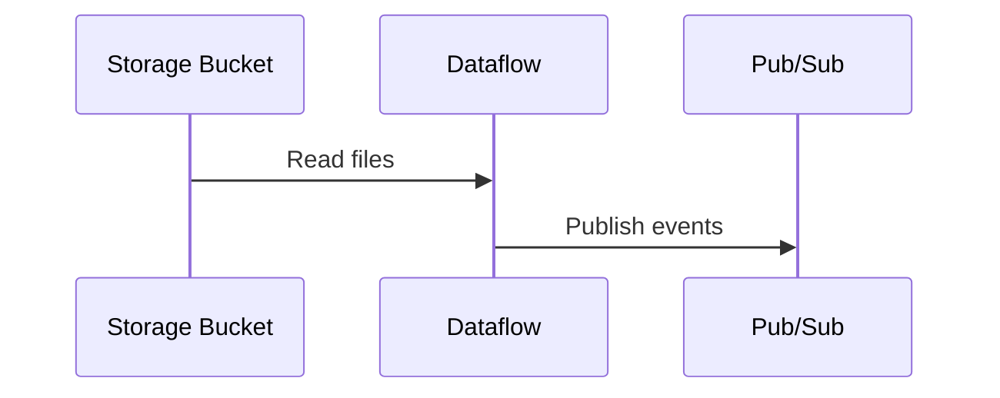

##  Overview



####    Steps

-   把BigQuery table schema json檔案上傳到Pub/Sub Topic

```bash
gsutil mb gs://<STORAGE BUCKET>
gsutil cp ./dod/schema-bq-flat.json gs://<STORAGE BUCKET>/schema-bq-flat.json
```

-   將Node.Js Script user defined function上傳
```bash
gsutil cp ../scripts/batch-jscript-handler.js gs://kaslchi-taxi-demo
```
-   透過Dataflow將Storage Bucket中的檔案發佈到Pub/Sub

```bash
gcloud dataflow jobs run ingestion-batch \
    --gcs-location gs://dataflow-templates/latest/Stream_GCS_Text_to_Cloud_PubSub \
    --parameters \
inputFilePattern=gs://kaslchi-taxi-demo/bookevent*.json,\
outputTopic=projects/kalschi-demo-001/topics/kalschi-bot-event-publisher
--region asia-east1
```