##  Overview

接下來我要建立一個Dataflow Pipeline把Pub/Sub中的叫車事件寫到BigQuery中

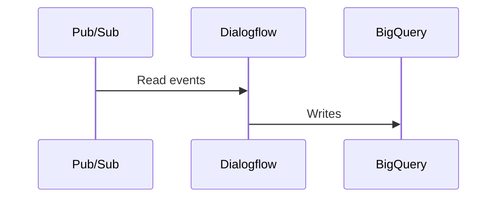

####    事件格式

-   在我的範例中，前端會傳回以下的事件到Pub/Sub Topic中

```json
{
    "conversationId": "xxx",
    "time": "2019-12-11T10:00:21.000000Z",
    "from_latitude": 234.123,
    "from_longitude": 567.876,
    "from_address": "xxx",
    "to_latitude": 234.123,
    "to_longitude": 567.876,
    "to_address": "xxx",
    "plate_no":"1688-TW",
    "distance":9.6,
    "customer_hash":"some hash"
}
```

####    建立DataSet並設定權限

-   在BigQuery建立DataSet並將BigQuery Editor角色指定給Service Account，接下來我們會用同樣的Service Account建立Dataflow pipeline

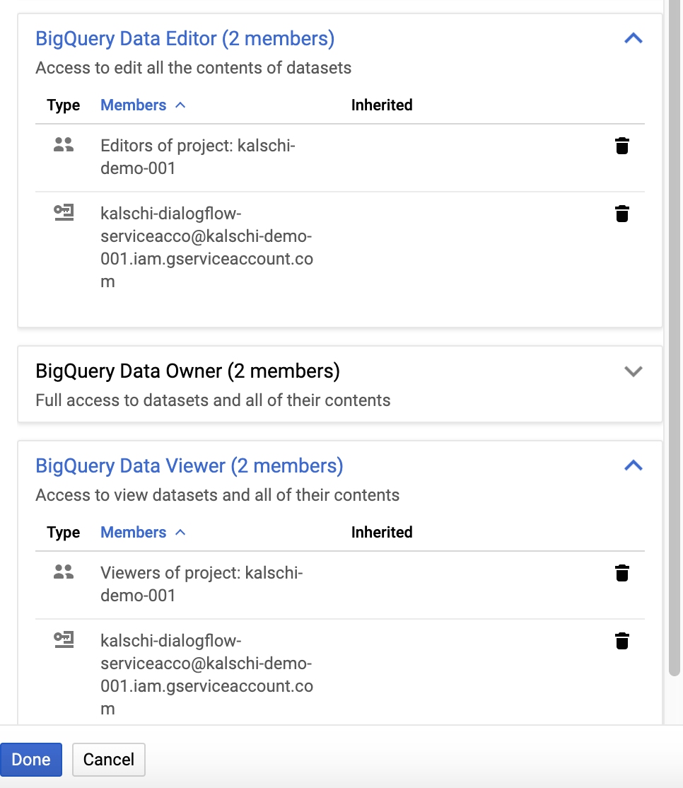

-   我預先建立了一個[BigQuery Table定義檔](./schema-bq-flat.json)

####    建立BigQuery Table

-   先建立BigQuery Dataset

```bash
bq --location=asia-east1 mk --dataset --description 'Dialogflow Demo' kalschi-demo-001:conversational_ai_anaytics
```

-   用上面建立的定義檔來建立Table

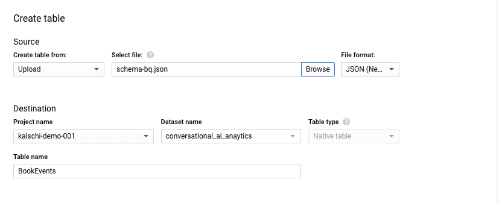

-   建立完成後應該會看到下面的結構

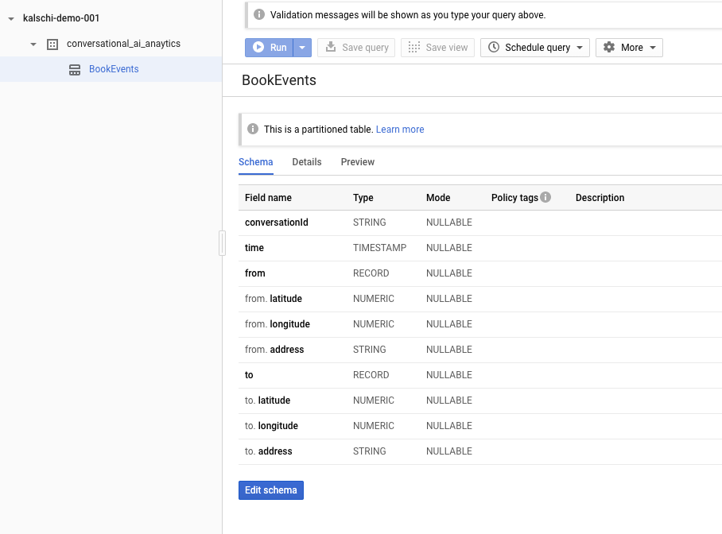


####    建立Dataflow Pipeline


-   先建立一個供Dataflow暫存資料的暫存區

```bash
gsutil mb gs://kalschi-temp
```

-   我直接利用Google Cloud Dataflow預先建立好的Pub/Sub到BigQuery的Flow template來建立我的Data pipeline

    -   Pub/Sub Subscrption名稱格式為projects/<PROJECT_ID>/subscriptions/<SUBSCRIPTION_NAME>
    
    -   BigQuery output Table名稱格式為<PROJECT_ID>:<DATASET_NANE>.<TABLE_NAME>

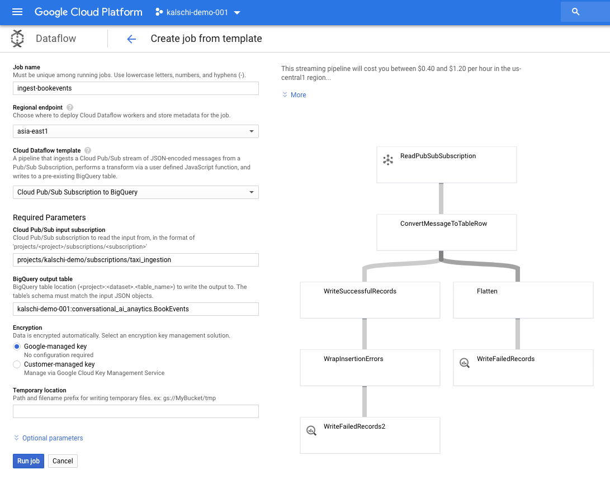

-   為我們為專案建立的的Service Account賦予Dataflow Worker權限

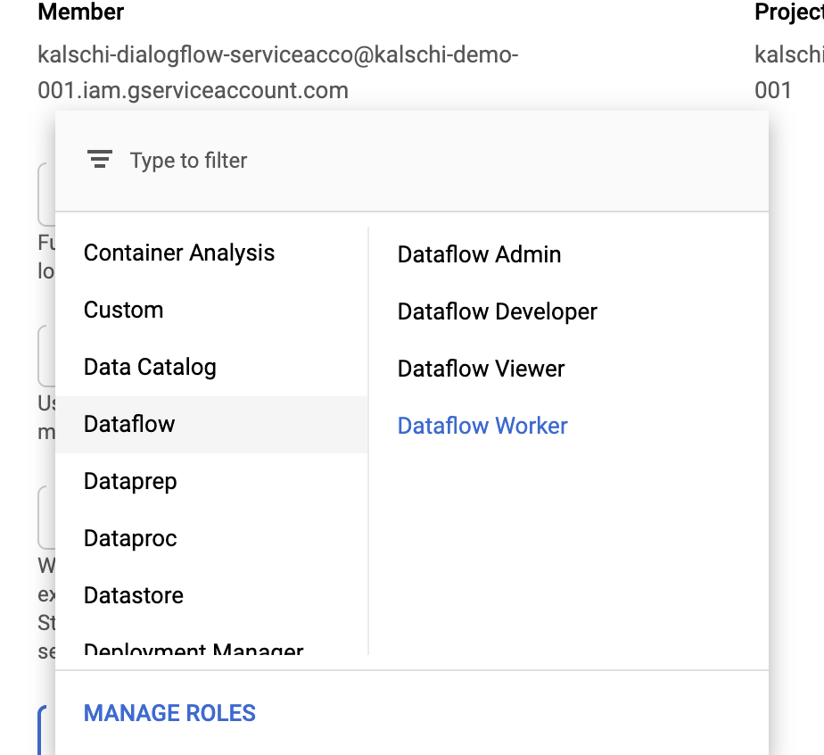

-   指定Service Account為我們為專案建立的的Service Account

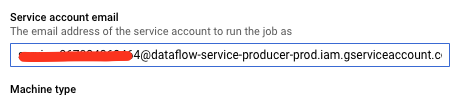

-   回到Pub/Sub Subscription，設定Dataflow權限給Service Account

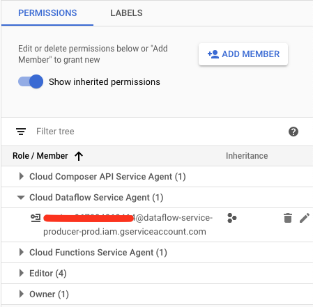

```bash
gcloud dataflow jobs run ingestion-20191212-3 --gcs-location gs://dataflow-templates/latest/PubSub_Subscription_to_BigQuery --parameters inputSubscription=projects/kalschi-demo-001/subscriptions/taxi_ingestion,outputTableSpec=kalschi-demo-001:conversational_ai_anaytics.BookEvents --service-account-email kalschi-dialogflow-serviceacco@kalschi-demo-001.iam.gserviceaccount.com  --max-workers 1 --region asia-east1

```


##  Troubleshooting

####   確認權限設定是否正確

    以我的範例，我的Dataflow, Pub/Sub的Service Account都是kalschi-dialogflow-serviceacco@kalschi-demo-001.iam.gserviceaccount.com

    -   Dataflow必須可以存取Pub/Sub Subscriptions

        Service Account必須是Topic與Subscriptions的Editor

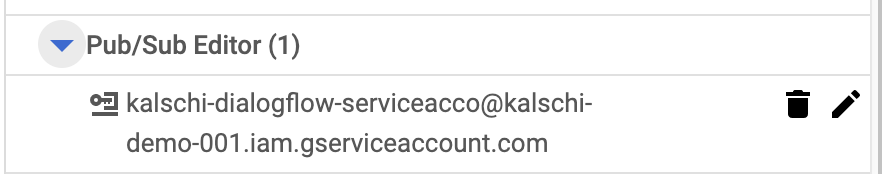
<br/>
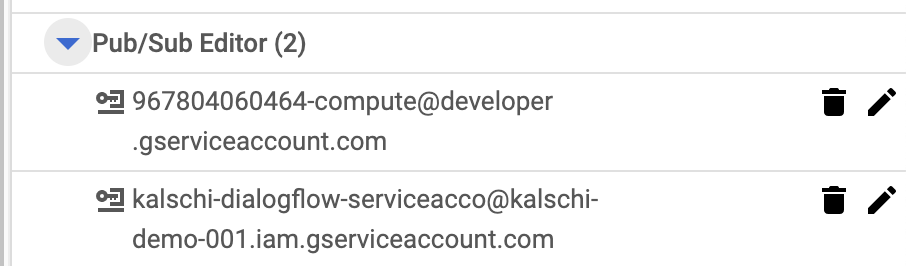

    -   Dataflow必須可以存取BigQuery Dataset

        Service Account必須是BigQuery Editor & BigQuery Viewer


####    Stackdriver

-   在Stackdriver可以查到相關錯誤訊息

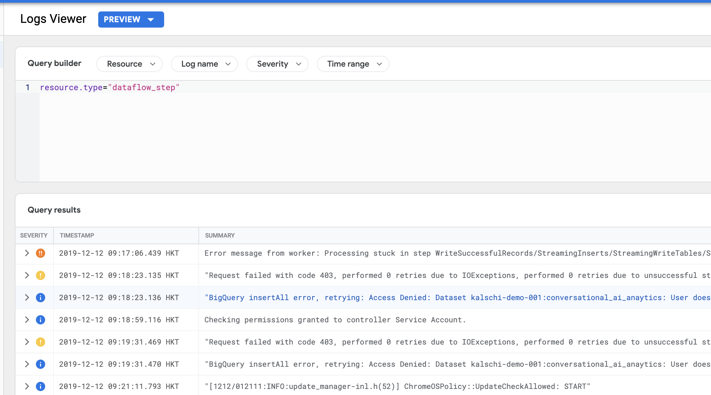
