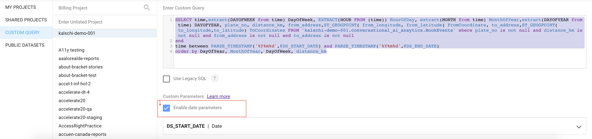
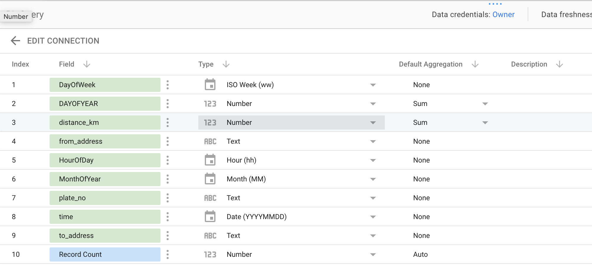
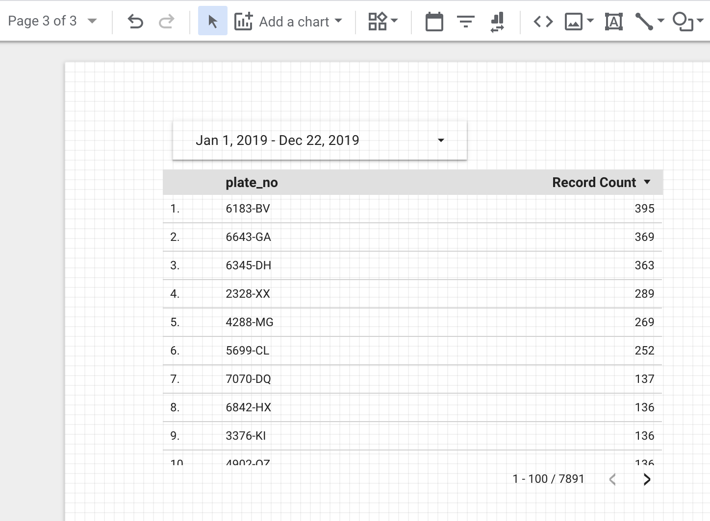

##  Overview

資料匯入BigQuery之後，接下來我們可以透過DataStudio建立BI報表.

####    Create a Report in DataStudio

-   到[DataStudio](https://datastudio.google.com/)介面，新增一份報表，然後在資料來源處選擇BigQuery Table

-   在查詢視窗輸入以下的SQL Query，同時確認有勾選使用參數

```sql
SELECT time,extract(DAYOFWEEK from time) DayOfWeek, EXTRACT(HOUR FROM (time)) HourOfDay, extract(MONTH from time) MonthOfYear,extract(DAYOFYEAR from time) DAYOFYEAR, plate_no, distance_km, from_address,ST_GEOGPOINT( from_longitude, from_latitude) FromCoordinate, to_address,ST_GEOGPOINT(  to_longitude,to_latitude) ToCoordinates FROM `kalschi-demo-001.conversational_ai_anaytics.BookEvents` where plate_no is not null and distance_km is not null and from_address is not null and to_address is not null 
and 
time between PARSE_TIMESTAMP('%Y%m%d',@DS_START_DATE) and PARSE_TIMESTAMP('%Y%m%d',@DS_END_DATE)
order by DayOfYear, MonthOfYear, DayOfWeek, distance_km
```



-   確認欄位型別都正確



-   接著就可以在報表上加入圖表了，由於先前有勾選參數，因此可以透過Date Range來控制報表上資料的日期範圍區間


