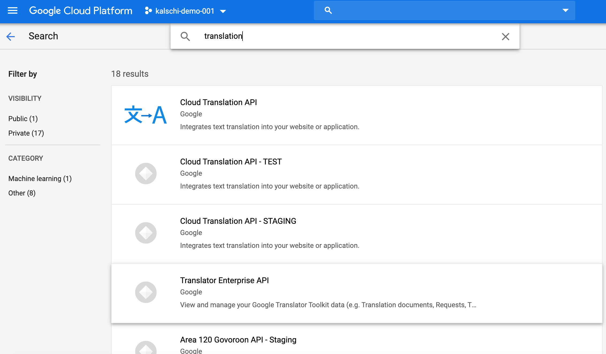

####    Enable Translation API

-   到[GCP Console](https://console.cloud.google.com), API & Services, Library找到Cloud Translation API並確認已經Enable



####    Create DialogFlow API Layer

在這裡我要用Node.JS寫一個REST API，這個API會提供給Dialog Flow呼叫來翻譯使用者的語句．目前Cloud Functions提供的[Runtime環境](https://cloud.google.com/functions/docs/concepts/exec)為Node.JS 8, 10 (BETA), Go與Python．在此我使用Node.JS 10的版本．

完整的Source Code在[這裏](../index.js)

##### 本機測試

-   切換到tests目錄，確定service-account-key.json已經[下載並複製到keys目錄](./env-setup.md#create-service-account)

-   執行下面指令測試Translation API是否可正常運作

```bash
node test-translationAPI.js

## kalschi-demo-001 - global
## Translation: 愛してる
## got:愛してる
```

##### 部署到Cloud Functions

Cloud Functions程式中如果有需要有參數，可以透過GCP Console或是Gcloud命令設定；設定的參數在執行時程式可以以環境變數的方式取得

在這裡的程式中，我們共需要兩個環境變數，Node.Js程式會以如下的方式取得

```javascript
var translator = new Translator(
    {
        projectId: process.env.PROJECT_ID, 
        location: process.env.LOCATION
    });
```

-   執行以下命令以部署Cloud Functions其中的

    -   <Function Name>必須為index.js中export的函式名稱；以這個例子來說，為dialogflowFirebaseFulfillment

    -   <SERVICE_ACCOUNT_ID>為剛剛建立的Service Account ID，以我的例子而言為kalschi-dialogflow-serviceacco@kalschi-demo-001.iam.gserviceaccount.com
    
    -   <PROJECT_ID>為Project Id，以我的例子而言為kalschi-demo-001；此為Translation API需要的參數

    -   <LOCATION>必須為global；此為Translation API需要的參數

    
```bash
gcloud functions deploy <Function Name> --runtime nodejs10 --trigger-http --service-account <SERVICE_ACCOUNT_ID> --set-env-vars PROJECT_ID=<PROJECT_ID>,LOCATION=global

# gcloud functions deploy taxibotbackend --runtime nodejs10 --trigger-http --service-account kalschi-dialogflow-serviceacco@kalschi-demo-001.iam.gserviceaccount.com --set-env-vars PROJECT_ID=kalschi-demo-001,LOCATION=global
```


#### Troubleshooting

-   Include module files during deploying

>ERROR: (gcloud.functions.deploy) OperationError: code=13, message=Error setting up the execution environment for your function. Please try deploying again after a few minutes.

```bash
--include-ignored-files
```