## Create Dialogflow Agent

####    Create Entities

在這裡我要建立一個Agent幫使用者將文字翻譯成目標語言

-   登入[Dialogflow console](https://dialogflow.cloud.google.com/#/newAgent)並建立一個新的Agent

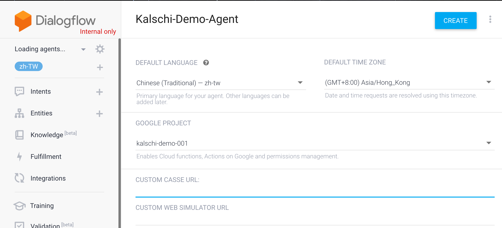

-   建立完成後，先建立一個新的Entity，作為目標翻譯語系；由於使用者可能要求翻譯各種語言，這邊我把Allow Automated Expansion打勾．

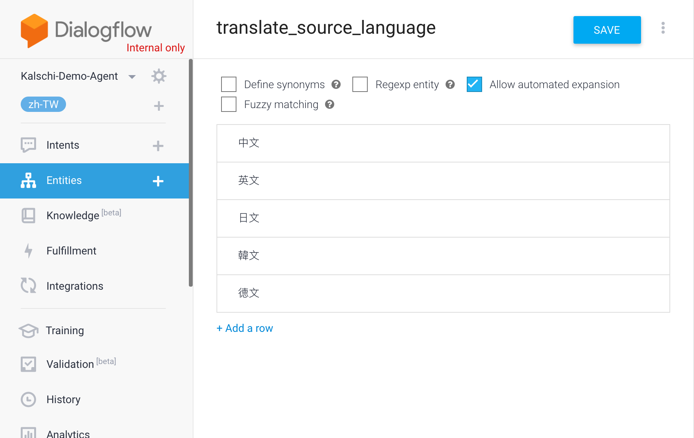

-   同樣的，在這裡雖然暫時還用不到，但為了將來擴充需要，我先建立一個Entity作為來源語系．

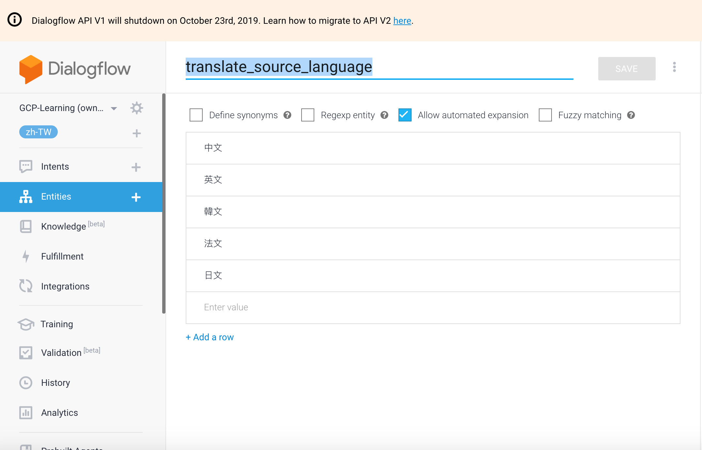

-   為需要翻譯的語句本身建立一個Entity

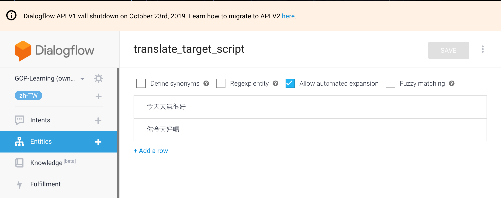

####    Create Translation Intent

-   新增一個新的Intent，名稱為Intent_Translation．並為它加上Context．

    Context代表交談的情境，可以讓Agent透過Context記住目前對話的情景．例如以下的對話中；

    「台北市明天天氣如何？」

    「明天台北會下雨」

    「有什麼好玩的地方嗎？」

    「陽明山、台北101等等」

    第一段對話已經將情景，也就是Context設定為台北市；因此後續對話中，即使不特別提到台北市，對話的雙方也知道目前在討論的是台北市有哪些好玩的地方．這就是Context的功能．

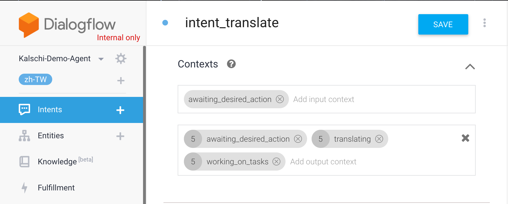

-   接著為這個Intent新增一些訓練語句並在句子中標示出相對應的Entity

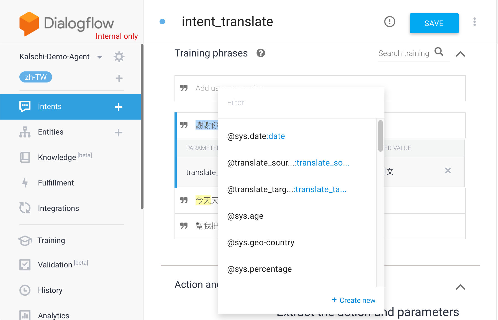

-   在參數欄位中把translation_target_language和translation_target_script設為必要

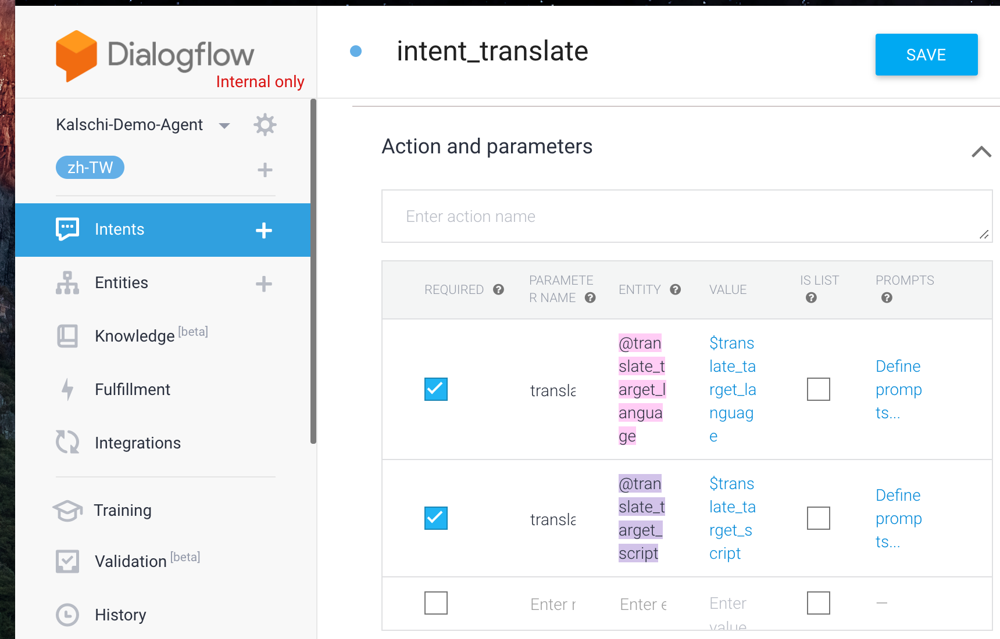

-   也可以為每一個Entity加上提示，當使用者沒有提供這個資訊的時候，Dialogflow Agent會自動用這個提示要求使用者輸入相關資訊

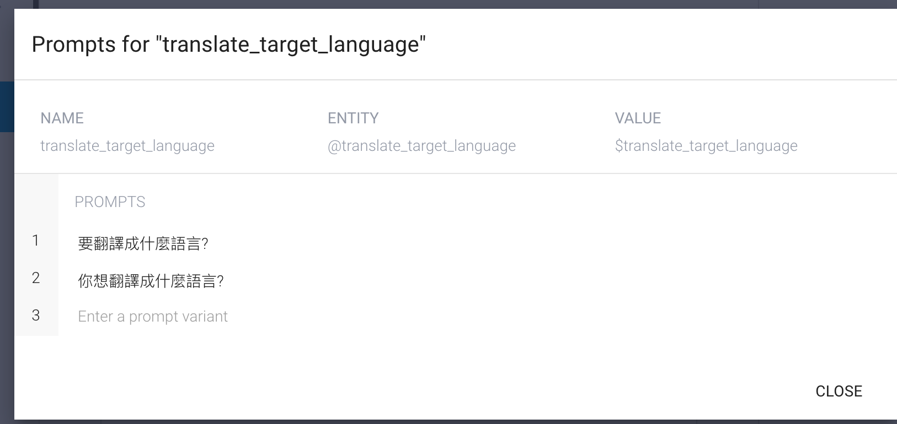

-   在Fulfillment頁籤上勾選"Enable Webhook for this intent"

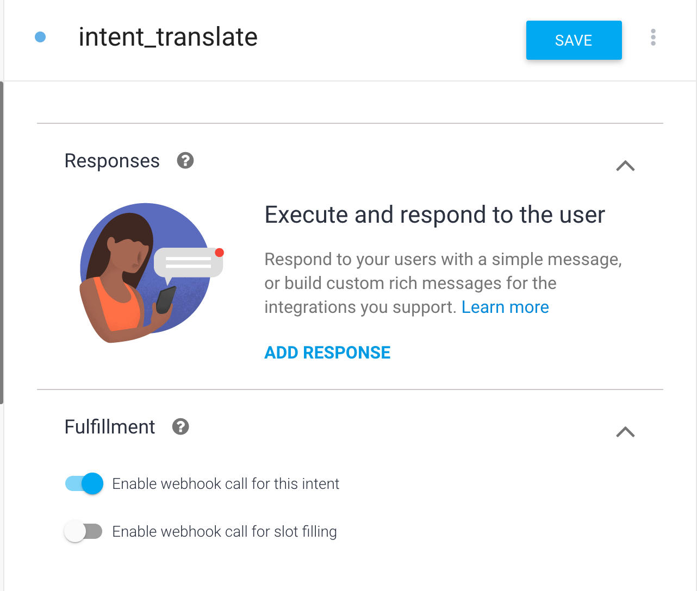

-   完成後記得儲存


####    Create Goodbye Intent

接下來我要建立一個Intent作為結束對話之用

-   設定Context

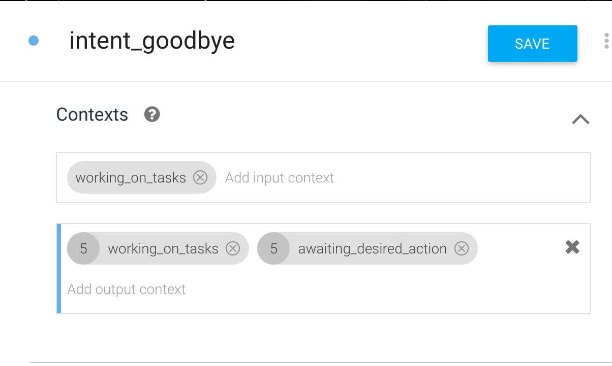

-   設定語句

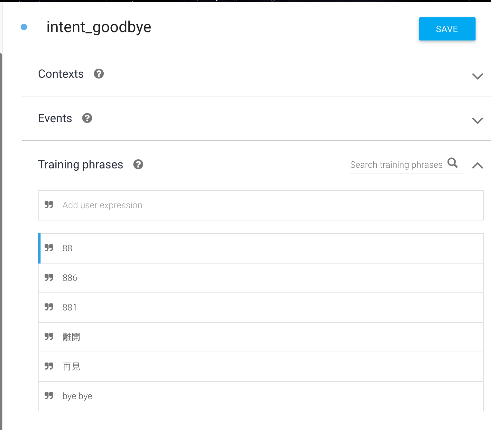

-   指定結束對話

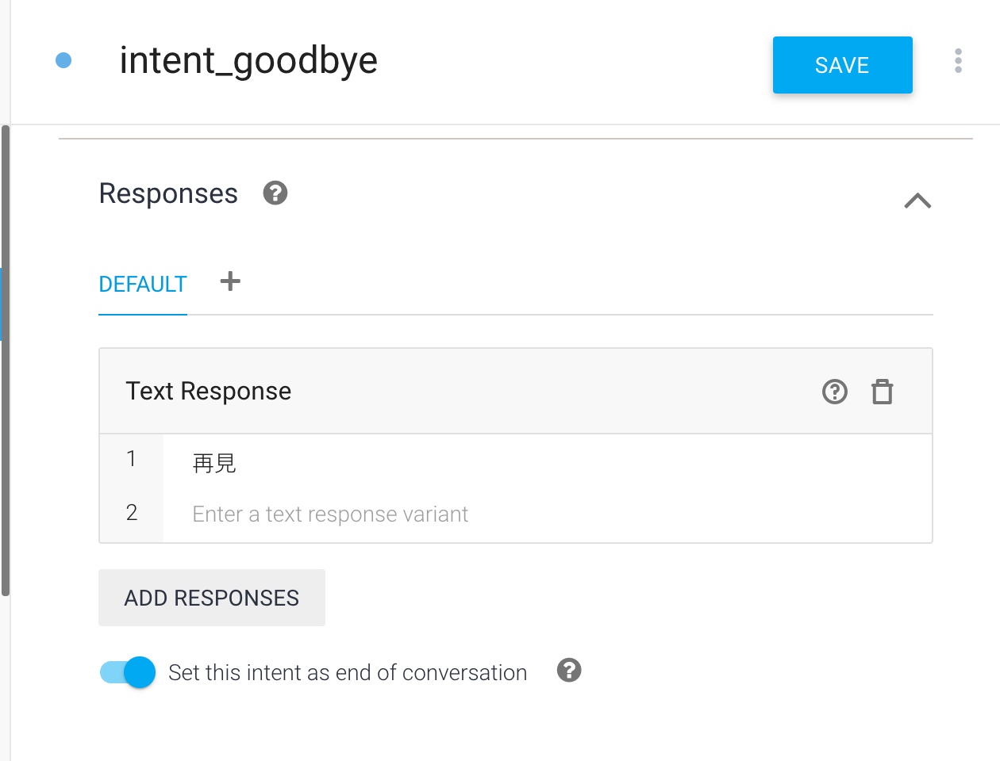

####    Update Default Welcome Intent

-   當進入對話後，指定Content

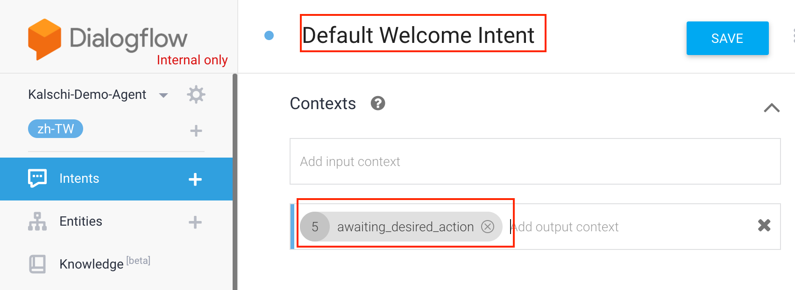


####    Configure Fulfillment

-   打開Console或是在GCP Console打開Cloud Shell，執行以下指令取得部署後的Cloud Functions的URL

```bash
gcloud functions describe <CLOUD FUNCTIONS NAME>
```

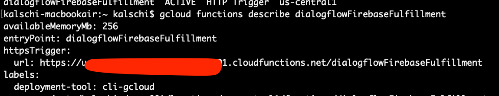

-   回到Dialogflow console，切換到Fulfillment頁籤，指定Webhook URL為剛剛取得的Cloud Functions URL

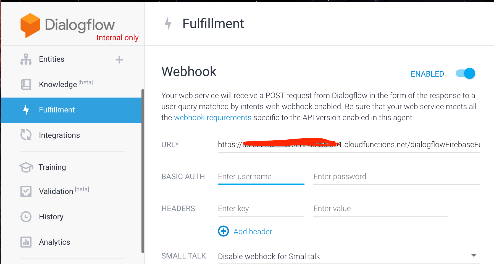

-   結束後儲存

-   接著可以在旁邊的測試欄位測試是否可以正常翻譯

