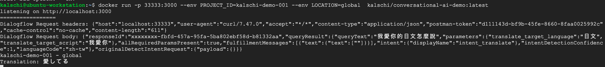
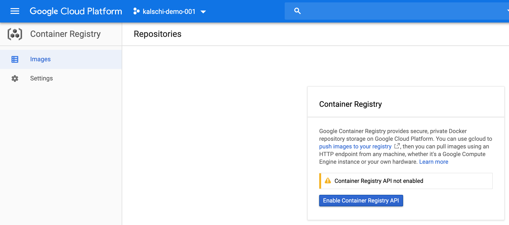

##  Create a REST API with Express

既然程式已經在Cloud Functions上驗證可行，接下來我要把程式移植到Kubernets上．首先，我使用Express建立一個簡單的REST API並在本機上確認可執行．

-   在Package.json中加入Express

```json
  "dependencies": {
    "express": "*", //...
  }
```

-   建立一個新檔案名為app.js作為入口，代碼如下；

```javascript
var dialogflowFirebaseFulfillment = require('./index').dialogflowFirebaseFulfillment;
var express = require('express')
var bodyParser = require('body-parser')
var app = express()

// parse application/x-www-form-urlencoded
app.use(bodyParser.urlencoded({ extended: false }))

// parse application/json
app.use(bodyParser.json())
app.use(function (req, res) {
    dialogflowFirebaseFulfillment(req,res);
})

app.listen(3000);

console.log('listening on http://localhost:3000');
```

-   在本機執行測試

```bash
export PROJECT_ID=<PROJECT_ID>
export LOCATION=global
node app
```

-   使用POSTMAN或其他REST API測試工具對http://localhost:3000 POST以下內容

```json
{
  "responseId": "xxxxxxxx-fbfd-457a-95fa-5ba802ebf58d-b81332aa",
  "queryResult": {
    "queryText": "我愛你的日文怎麼說",
    "parameters": {
      "translate_target_language": "日文",
      "translate_target_script": "我愛你"
    },
    "allRequiredParamsPresent": true,
    "fulfillmentMessages": [
      {
        "text": {
          "text": [
            ""
          ]
        }
      }
    ],
    
    "intent": {
      "displayName": "intent_translate"
    },
    "intentDetectionConfidence": 1,
    "languageCode": "zh-tw"
  },
  "originalDetectIntentRequest": {
    "payload": {}
  }
}
```

  - 應該要可以看到如下的回應

```json
{
    "fulfillmentText": "愛してる",
    "outputContexts": []
}
```

#### Containerize REST API

- 既然在本機上執行Express成功，接下來我便可以建立Dockerfile將此APIContainer化

  -   建立一個新檔案並命名為Dockerfile

```dockerfile
## 指定base image
FROM node

##  在image上建立一個/app目錄
RUN mkdir /app

##  將host(開發環境中)的目前目錄下的所有檔案copy到image中的/app目錄
COPY . /app

##  指定image中的工作目錄為 /app
WORKDIR /app

##  安裝node.hs dependencies
RUN npm install

##  執行node app.js
CMD ["node", "app.js"]
```

- 在命令列執行以下指令建置docker image

  - 其中<TAG>為Docker image的Tag名稱，例如: kalschi/conversational-ai-demo:latest

```bash
docker build -f ./Dockerfile . -t <TAG>
```

- 使用以下指令將container在本機執行起來

```bash
docker run -p 33333:3000 kalschi/conversational-ai-demo:latest -e PROJECT_ID=<PRPJECT_ID> -e LOCATION=global -d
# docker run -p 33333:3000 kalschi/conversational-ai-demo:latest -e PROJECT_ID=kalschi-demo-001 -e LOCATION=global
```

- 接著執行以下指令測試

```bash
docker run -p 33333:3000 --env PROJECT_ID=kalschi-demo-001 --env LOCATION=global <TAG>
# docker run -p 33333:3000 --env PROJECT_ID=kalschi-demo-001 --env LOCATION=global  kalschi/conversational-ai-demo:latest
```

- 開啟一個新的SSH連線或Console並執行以下指令測試結果

```bash
curl -X POST \
  http://localhost:33333 \
  -H 'Content-Type: application/json' \
  -H 'Postman-Token: d111143d-bf9b-45fe-8660-8faa0025992c' \
  -H 'cache-control: no-cache' \
  -d '{
  "responseId": "xxxxxxxx-fbfd-457a-95fa-5ba802ebf58d-b81332aa",
  "queryResult": {
    "queryText": "我愛你的日文怎麼說",
    "parameters": {
      "translate_target_language": "日文",
      "translate_target_script": "我愛你"
    },
    "allRequiredParamsPresent": true,
    "fulfillmentMessages": [
      {
        "text": {
          "text": [
            ""
          ]
        }
      }
    ],
    "intent": {
      "displayName": "intent_translate"
    },
    "intentDetectionConfidence": 1,
    "languageCode": "zh-tw"
  },
  "originalDetectIntentRequest": {
    "payload": {}
  }
}'
```

- 應該可以看到以下結果




####  Setup container registry

- 在這裡我使用GCP Container Registry作為Container Image存放位置．到GCP確定Container Registry API已經啟用



- 回到Cloud Shell或是Console，執行以下指令

```bash
gcloud auth configure-docker
```

- Tag Source image, 其中

  - GCR_HOST可以參考[這裡](https://cloud.google.com/container-registry/docs/pushing-and-pulling?hl=en_US&_ga=2.60075886.-2128082994.1572832382)選擇以下幾種

    - gcr.io
    - us.gcr.io
    - eu.gcr.io
    - asia.gcr.io

```bash
docker tag <LOCAL_IMAGE_NAME> <GCR_HOST>/<PROJECT_ID>/<IMAGE_AND_TAG>
# docker tag kalschi/conversational-ai-demo:latest  asia.gcr.io/kalschi-demo-001/conversational-ai-demo:latest
```

-  Push到Goole Container Registry

```bash
docker push  <LOCAL_IMAGE_NAME> <GCR_HOST>/<PROJECT_ID>/<IMAGE_AND_TAG>
# docker push asia.gcr.io/kalschi-demo-001/conversational-ai-demo:latest
```