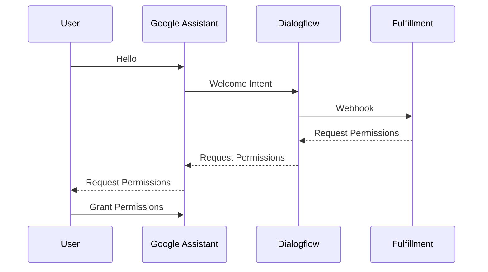
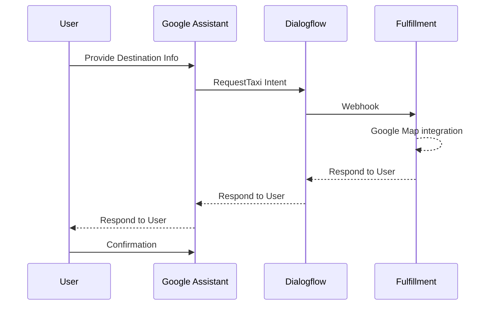
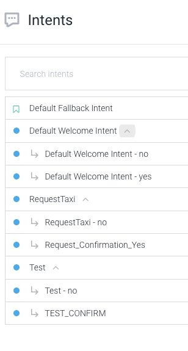
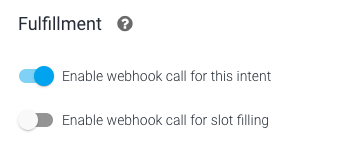
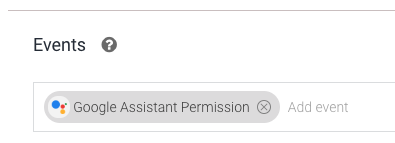
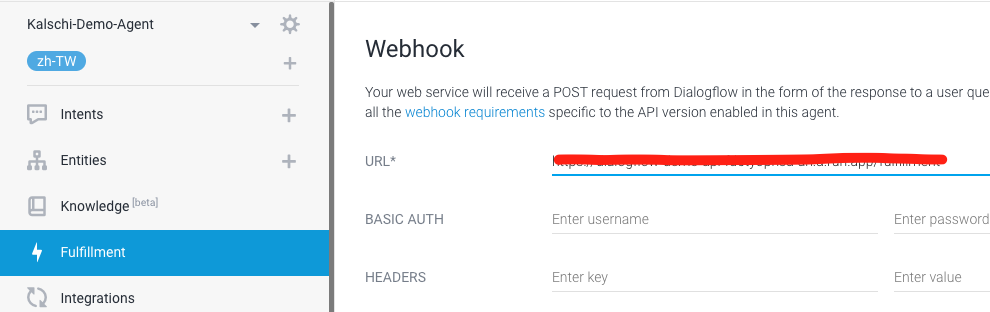
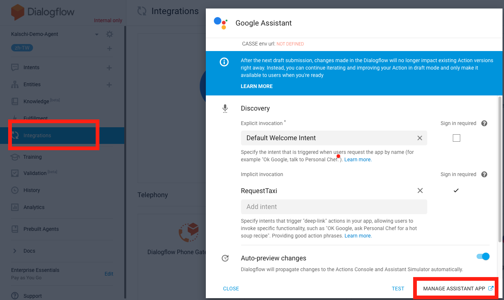
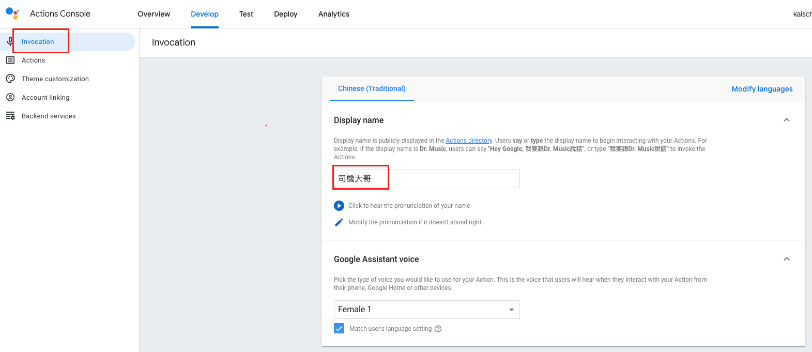

## Create Dialogflow Agent

為了更進一步了解Dialogflow與Actions on Google的整合, 我將原本的Agent修改如下

####    Flow diagram

-   在對話開始時要求使用者位置資訊

-   要求使用者提供目的地資訊

####    Create Intents

-   建立如下的Intent

-   訓練相關Intent

在這個範例中我會使用以下的系統Entity．這裡就不再敘述如何訓練

    -   @sys.date
    -   @sys.time
    -   @sys.location

-   在以下Intent啟用Fulfillment

    -   Default Welcome Intent
    -   Default Welcome Intent - yes
    -   RequestTaxi
    -   Request_Confirmation_Yes

-   對以下Intent設定Event為Google Assistant Permission

    在Welcome Intent時我們會要求使用者給予權限，當使用者願意賦予權限時，系統便會根據這個設定調用這個Intent

    -   Default Welcome Intent - yes

-   對以下Intent設定Event為Google Assistant Options

    當我們詢問使用者是否確定要叫車時，會請使用者輸入是或否，此時便會調用這個Intent

    -   Request_Confirmation_Yes

-   設定Fulfillment

####    設定Actions on Google資訊

-   設定呼叫的Intent並到Actions on Google設定頁面

-   在Develop, Invocation頁籤指定我們的Action名稱

-   為了正常在手機Google Assistant運作，需要指定相關的Capability

