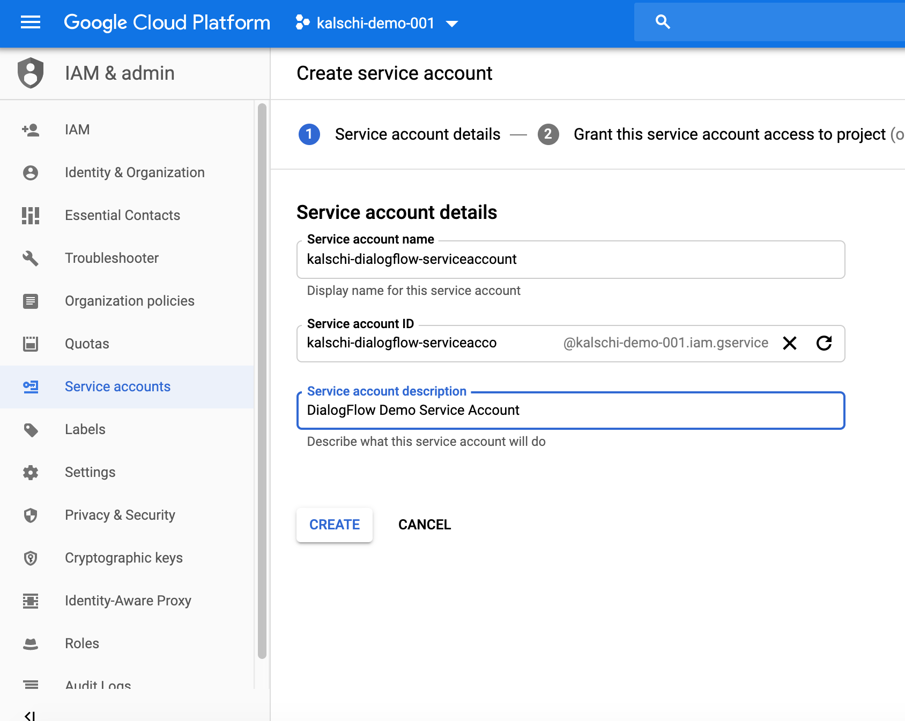
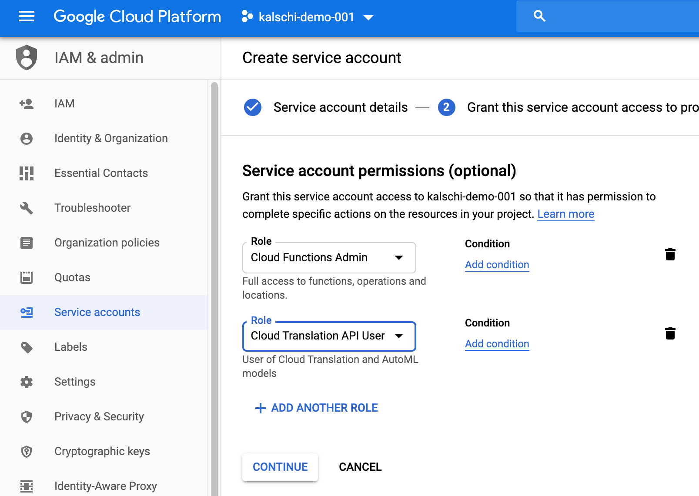
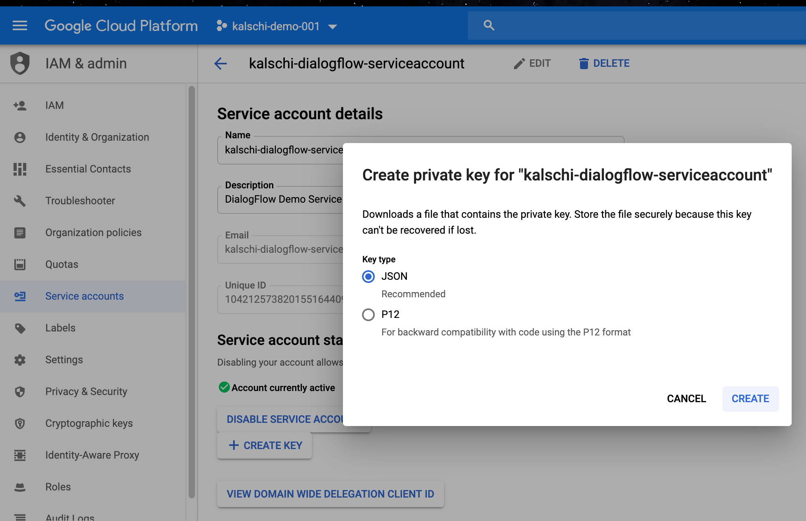

#### Development Environment Setup

-   下載並安裝 nvm

    -   [Windows](https://github.com/coreybutler/nvm-windows/releases)

    -   [MacOS](https://www.chrisjmendez.com/2018/02/07/install/)

-   下載並安裝 [Google Cloud SDK](https://cloud.google.com/sdk/docs/downloads-interactive)

#### Setup Git SSH Key on Windows

-   打開cmd，執行以下指令

```shell
ssh-keygen -t rsa 
```

-   根據指示輸入密碼

-   到GCP console](https://source.cloud.google.com/user/ssh_keys?register=true), 建立一個SSH Key

-   打開 C:\users\[your name]\.ssh\id_rsa.pub 檔案，複製所有內容

-   將複製的內容貼到GCP Console的SSH Key

-   儲存並註冊


####    Create Service Account

-   到GCP Console, IAM, Service Account, 建立一個新的Service Account



-   給與Cloud Functions Admin與Translation API User角色，並記下Serivce Account Id



-   建立完成後，選擇剛剛的Service Account，建立一個新的Key；這會下載一個Json檔案，將檔案複製到keys目錄中．



>
#### Service Account Setting

-   到[DialogFlow](https://dialogflow.cloud.google.com/)介面建立一個新的Agent, 並記下Service Account


-   回到GCP Console，確認Translation API已經啟用，並將剛剛的Service Account加入必要的角色

    -   Translation API使用者


