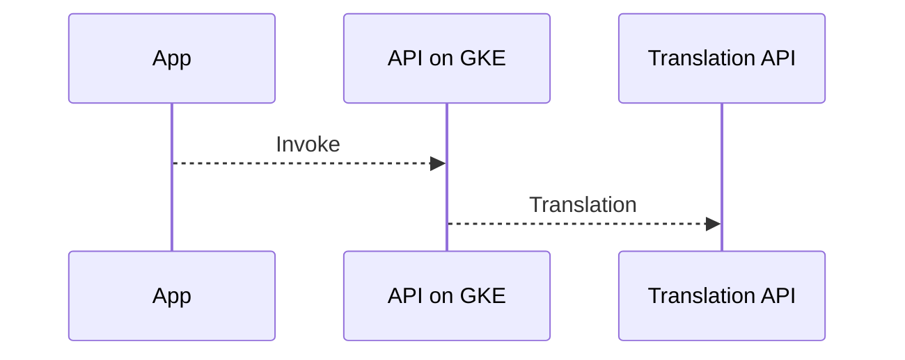
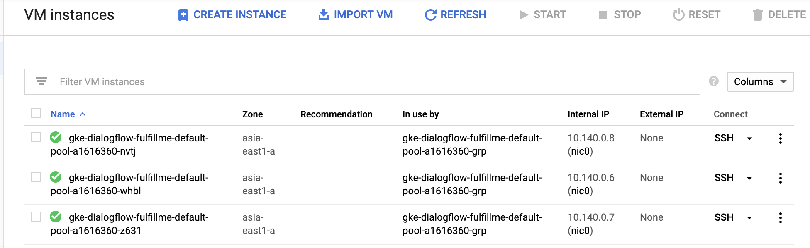
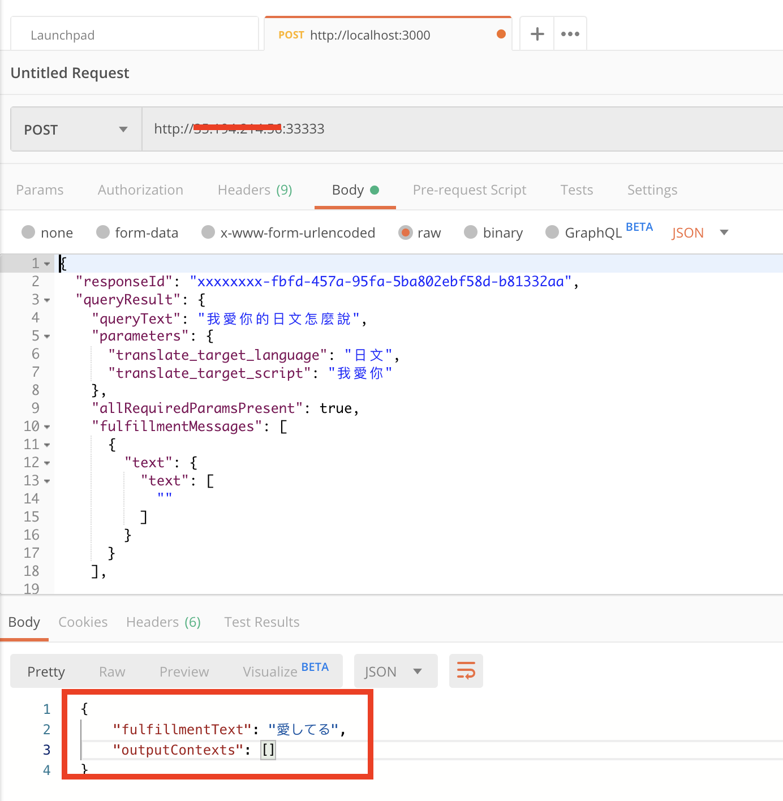

## Kubernetes Cluster

####    Create Kubernetes Cluster

接下來，我想把Cloud Functions換成Kubernetes．



-   首先，先完成簡單的事情，建立一個新的GKE Cluster．

    這邊我不希望我的節點直接對外，因此我指定了--enable-private-nodes --enable-ip-alias --master-ipv4-cidr三個參數，其中我把master-ipv4-cidr指定為172.168.1.0/28以避免與該subnet的IP範圍重疊

    以下的指令會建立一個只有1個節點的Cluster．命令列參數可以參考[這裡](https://cloud.google.com/sdk/gcloud/reference/container/clusters/create#--num-nodes)

    此Cluster會以指定的Service Account建立

```shell
gcloud container clusters create <Cluster Name> --zone <ZONE> --machine-type <MACHINE_TYPE> --enable-private-nodes --enable-ip-alias --enable-master-authorized-networks --master-ipv4-cidr 172.16.1.0/28 --service-account kalschi-dialogflow-serviceacco@kalschi-demo-001.iam.gserviceaccount.com --num-nodes 1

#   gcloud container clusters create dialogflow-fulfillment --zone asia-east1-a --machine-type n1-standard-1 --enable-private-nodes --enable-ip-alias --enable-master-authorized-networks --master-ipv4-cidr 172.16.1.0/28 --service-account kalschi-dialogflow-serviceacco@kalschi-demo-001.iam.gserviceaccount.com --num-nodes 1
```

-   建立完成後到VM Instance查看，可以發現確實沒有Public IP (以下截圖中有三個節點，如果在上面的指令中指定了--num-nodes 1時則只會有一個節點)



-   在Cloud Shell或是Commnad Prompt執行以下指令已連線到Cluster

```shell
gcloud container clusters get-credentials <CLUSTER NAME> --zone <ZONE> --project <PROJECT ID>
#   gcloud container clusters get-credentials   
```

-   接下來我們先建立一個Deployment Yaml檔案; Deployment是Kubernetes中最小的部署單位，Deployment同時也會管理Container的生命週期．

    在Deployment.yaml中，我們會需要指定使用哪一個container image，由於這裡使用的是Google Container Registry，我們一樣需要設定Service Account的存取權限

    >Container Registry背後還是使用Storage Bucket存放Container Image，因此我們需要找到這個Bucket並給予Service Account權限．

-   在Cloud Shell執行下列指令列出所有的Bucket

```shell
gsutil list
```

    應該可以看到如下的輸出，其中，Container Registry使用的Bucket有著以下的[命名規則](https://cloud.google.com/container-registry/docs/access-control#granting_users_and_other_projects_access_to_a_registry)

    >[REGION].artifacts.[PROJECT-ID].appspot.com

```shell
gs://asia.artifacts.kalschi-demo-001.appspot.com/
gs://kalschi-demo-001.appspot.com/
gs://staging.kalschi-demo-001.appspot.com/
```

-   找到該Bucket之後，在Cloud Shell執行以下指令[給予權限](https://cloud.google.com/container-registry/docs/access-control#granting_users_and_other_projects_access_to_a_registry)

```bash
gsutil iam ch [TYPE]:[EMAIL-ADDRESS]:objectViewer gs://[BUCKET_NAME]
#   gsutil iam ch serviceAccount:kalschi-dialogflow-serviceacco@kalschi-demo-001.iam.gserviceaccount.com:objectViewer gs://asia.artifacts.kalschi-demo-001.appspot.com/
```


####    Create Deployment and Service yaml file

-   接下來我要定義deployment.yaml和service.yaml以作為稍後部署到Kubernetes Cluster之用

-   [df-deployment.yaml](../k8s/serviceAccount/df-deployment.yaml)

    在之前透過Cloud Functions存取Translation API時, 我們會需要設定Cloud Functions的Serivce Account並給予他相對應的權限, Cloud Functions才能存取Translation API. 在GKE部署中也需要這樣設定, 因為在先前透過gcloud指令建立GKE Cluster的過程中已經指定了--service-account, 因此在這裏, 我的yaml中只需要設定使用哪些container image, replicas...等等即可. GKE會幫我處理Authentication/Authorization

```yaml
apiVersion: apps/v1
kind: Deployment
metadata:
    name: dialogflow-fulfillment
spec:
    selector:
        matchLabels:
            app: dialogflow-fulfillment
    replicas: 1
    template:
        metadata:
            labels:
                app: dialogflow-fulfillment
        spec:
            containers:
            -   name: dialogflow-fulfillment
                image: asia.gcr.io/kalschi-demo-001/conversational-ai-demo:latest
                ports:
                    -   name: http
                        containerPort: 3000
                env:
                    -   name: PROJECT_ID
                        value: kalschi-demo-001
                    -   name: LOCATION
                        value: global
```

-   [df-service.yaml](../k8s/serviceAccount/df-service.yaml)

    同樣的, 在這裏透過Service.yaml把我的程式發布為可對外提供服務的Service

```yaml
kind: Service
apiVersion: v1
metadata:
  name: dialogflow-fulfillment
spec:
  selector:
    app: dialogflow-fulfillment
  ports:
  - protocol: TCP
    port: 33333
    targetPort: 3000
  type: LoadBalancer
```

####    Deploy to GKE Cluster

-   執行以下指令部署Deployment & Service...

```bash
kubectl apply -f ./df-deployment.yaml
```

    結果發生Timeout錯誤！？

    這是因為在先前建立GKE Cluster時, 我指定節點為private, 因此這些節點都沒有public IP, 也不允許Internet存取. 這時我必須要指定哪個IP範圍才能存取Master Node, 在這個IP Range中的電腦也才能夠透過指令存取Master Node.

-   解決方法是在GCP Network中建立一台VM Instance作為跳板機, 在此機器上安裝GCP Cloud SDK, 在這裏透過kubectl指令部署


####    Create Bastion Instance and install required

-   首先建立一台VM位於同樣的VPN Network中並安裝GCP SDK與[kubectl](https://kubernetes.io/docs/tasks/tools/install-kubectl/#install-kubectl-on-linux)

```bash

sudo apt-get update && sudo apt-get install -y apt-transport-https
curl -s https://packages.cloud.google.com/apt/doc/apt-key.gpg | sudo apt-key add -
echo "deb https://apt.kubernetes.io/ kubernetes-xenial main" | sudo tee -a /etc/apt/sources.list.d/kubernetes.list
sudo apt-get update
sudo apt-get install -y kubectl
```

-   取得此Bastion VM的External IP位址

-   更新GKE Cluster master node允許的IP範圍

```bash
gcloud container clusters update dialogflow-fulfillment --enable-master-authorized-networks --master-authorized-networks <VM-EXTERNAL-IP>/32 --z
one asia-east1-a

# gcloud container clusters update dialogflow-fulfillment --enable-master-authorized-networks --master-authorized-networks 100.100.200.255/32 --zone asia-east1-a
```

-   再部署一次, 這次就可以成功部署了

```shell
kubectl apply -f ./df-deployment.yaml
kubectl apply -f ./df-service.yaml
```

-   回到cloud shell透過curl或是在其他機器上透過Postman等工具測試看看




####    References

-   https://cloud.google.com/container-registry/docs/access-control#granting_users_and_other_projects_access_to_a_registry

-   https://ithelp.ithome.com.tw/articles/10195944

-   https://cloud.google.com/kubernetes-engine/docs/tutorials/authenticating-to-cloud-platform?hl=zh-tw
