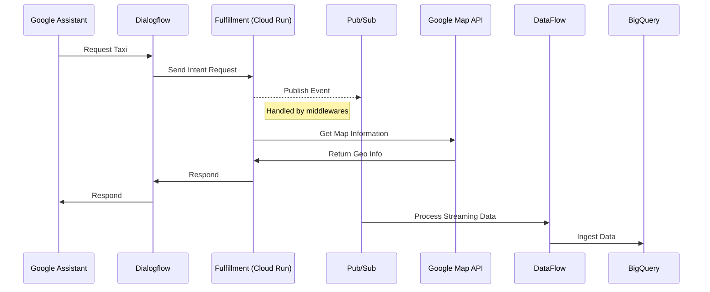
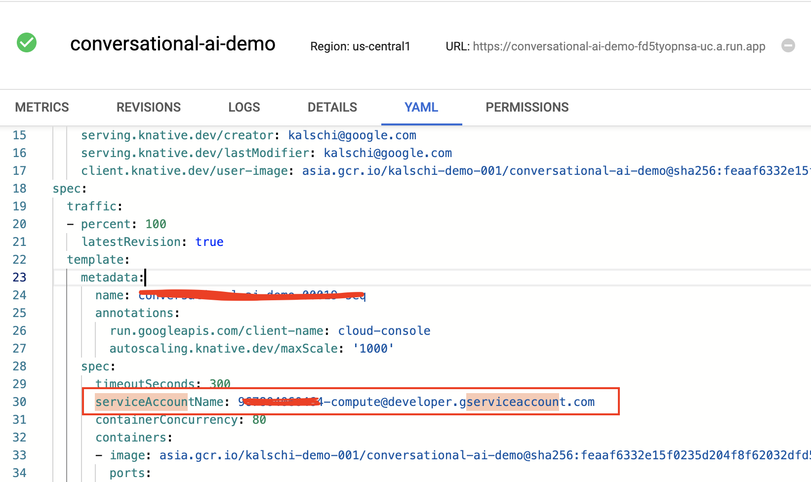

##  Overview

####    建立Pub/Sub Topics

-   建立一個Pub/Sub Topic接收使用者的叫車資訊

```bash
gcloud pubsub topic create book-taxi
```

####    設定權限

-   我們資料收取的架構看起來會像這樣，因此我們需要設定權限讓Cloud Run可以存取Pub/Sub




-   根據預設（我們先前並未特別設定）Cloud Run的Service Account會是\<INSTANCE-NUMBER\>-compute@developer.gserviceaccount.com



-   我們需要給予這個Service Account Pub/Sub Topic Publisher的權限

```bash
gcloud beta pubsub topics get-iam-policy projects/kalschi-demo-001/topics/kalschi-bot-event-publisher --format json > subscription_policy.json
```

```json
{
  "bindings": [
    {
      "members": [
        "serviceAccount:<INSTANCE>-compute@developer.gserviceaccount.com"
      ],
      "role": "roles/pubsub.admin"
    },
    {
      "members": [
        "serviceAccount:<INSTANCE>-compute@developer.gserviceaccount.com",
        "serviceAccount:kalschi-dialogflow-serviceacco@kalschi-demo-001.iam.gserviceaccount.com"
      ],
      "role": "roles/pubsub.publisher"
    }
  ],
  "etag": "xxxxxxx",
  "version": 1
}
```