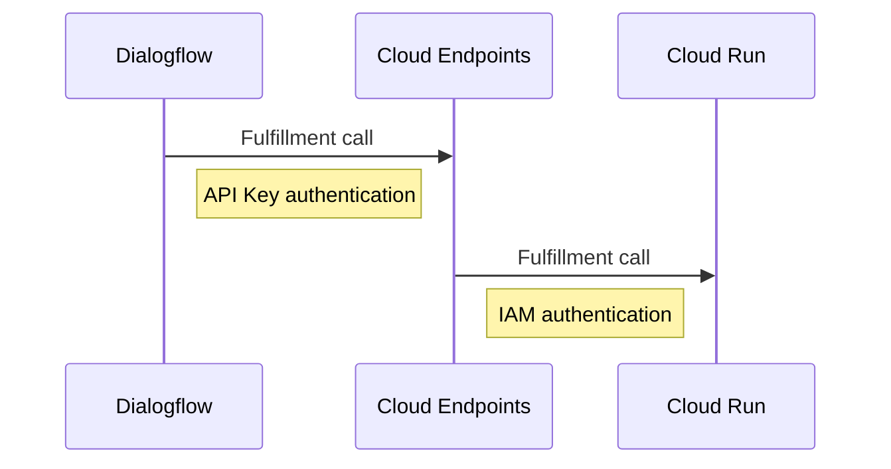

##  Overview

在GCP上我們一般會透過Service Account與IAM來設定服務的存取權限；在我的例子中，Cloud Run本身提供了Http Endpoint，而Dialogflow在呼叫Http Endpoint時必須手動在界面上指定Authorization Header與其JWT Token；Token本身會Expire．這樣其實並不符合Best Practice，因此在這裡我會透過Cloud Endpoints來作為Dialogflow呼叫的入口，在這裡針對任何對Cloud Run的呼叫進行驗證．




####    建立Endpoints

-   Deploy ESP to Cloud Run

```bash
gcloud beta run deploy CLOUD_RUN_SERVICE_NAME \
    --image="gcr.io/endpoints-release/endpoints-runtime-serverless:1.30.0" \
    --allow-unauthenticated \
    --project=ESP_PROJECT_ID

#   gcloud beta run deploy conversational-ai-webhook-endpoints --image="gcr.io/endpoints-release/endpoints-runtime-serverless:1.30.0"  --allow-unauthenticated  --project=kalschi-demo-001
```

-   建立[Swagger檔案描述](../yaml/cloud-run-def.yaml)Cloud Run (Fulfillment)API

    Cloud Endpoints使用ESP(Extensible Service Proxy)管理API, 我們透過Swagger定義檔在ESP上設定後端API的資訊

>   <mark>注意!</mark> 在YAML中，API Key名稱必須是key, 必須在query string, 否則會報以下錯誤

-   執行以下指令將定義檔部署到Endpoints ESP上

```bash
gcloud endpoints services deploy cloud-run-def.yaml --project kalschi-demo-001
```

-   如果在Swagger定義中API Key名稱不符合要求，會出現以下錯誤

```bash
ERROR: (gcloud.endpoints.services.deploy) INVALID_ARGUMENT: Cannot convert to service config.
'location: "cloud-run-def.yaml"
message: "apiKey \'api_key\' is ignored. Only apiKey with \'name\' as \'key\' and \'in\' as \'query\' are supported"
 location: "cloud-run-def.yaml: Operation \'post\' in path \'/fulfillment/\'"
message: "Operation does not require an API key; callers may invoke the method without specifying an associated API-consuming project. To enable API key all the SecurityRequ
irement Objects (https://github.com/OAI/OpenAPI-Specification/blob/master/versions/2.0.md#security-requirement-object) inside security definition must reference at least one
 SecurityDefinition of type : \'apiKey\'."
 location: "unknown location"
kind: ERROR
message: "http: In path template \'/fulfillment/\': unexpected end of input \'/\'."'
```

-   成功部署後會看到以下訊息

```bash
Waiting for async operation operations/serviceConfigs.dialogflow-demo-api-endpoints-xxxxxxxx-an.a.run.app:xxxxx-xxxx-xxxx-xxxx-xxxx to complete...
Operation finished successfully. The following command can describe the Operation details:
gcloud endpoints operations describe operations/serviceConfigs.dialogflow-demo-api-endpoints-xxxxxxxx-an.a.run.app:xxxxx-xxxx-xxxx-xxxx-xxxx

Service Configuration [2019-12-10r0] uploaded for service [dialogflow-demo-api-endpoints-xxxxxx-an.a.run.app]

To manage your API, go to: https://console.cloud.google.com/endpoints/api/dialogflow-demo-api-endpoints-fd5tyopnsa-an.a.run.app/overview?project=kalschi-demo-001
```

####    設定Endpoints

-  接下來，我們要在Endpoint Cloud Run Container(不是Fulfillment Cloud Run)上指定ESP服務資訊

```bash
gcloud beta run services update \<ENDPOINTS_SERVICE_NAME\>  \
       --set-env-vars ENDPOINTS_SERVICE_NAME=\<ENDPOINT_SERVICE_HOST\> \
       --project ESP_PROJECT_ID

# gcloud beta run services update conversational-ai-webhook-endpoints --set-env-vars ENDPOINTS_SERVICE_NAME=conversational-ai-webhook-endpoints-fd5tyopnsa-uc.a.run.app --project kalschi-demo-001
```

-   設定權限，讓Endpoint Cloud Run的Service Account可以呼叫後端的Cloud Run

```bash
gcloud beta run services add-iam-policy-binding BACKEND_SERVICE_NAME \
    --member "serviceAccount:ESP_PROJECT_NUMBER-compute@developer.gserviceaccount.com" \
    --role "roles/run.invoker" \
    --project BACKEND_PROJECT_ID

# gcloud beta run services add-iam-policy-binding conversational-ai-demo --member "serviceAccount:967804060464-compute@developer.gserviceaccount.com" --role "roles/run.invoker" --project kalschi-demo-001
```

-   啟用以下的API

```bash
gcloud services enable servicemanagement.googleapis.com
gcloud services enable servicecontrol.googleapis.com
gcloud services enable endpoints.googleapis.com
```

####    使用API

到這裡我們已經將Endpoint設定完成了，接下來我們要透過Endpoints提供的Developer Portal註冊並取得API Key

-   到Developer Portal. 網址應該是 https://endpointsportal.<PROJECT-NAME>.cloud.goog


-   到Fulfillment Cloud Run設定頁面上移除"allUsers"的存取

-   將Dialogflow的Fulfillment Url改為新的位址如下

>https://\<YOUR-ENDPOINTS-CLOUD-RUN-URL\>/fulfillment?key=\<YOUR API KEY\>

##  Reference

-   [Get Started Cloud Run](https://cloud.google.com/endpoints/docs/openapi/get-started-cloud-run)
