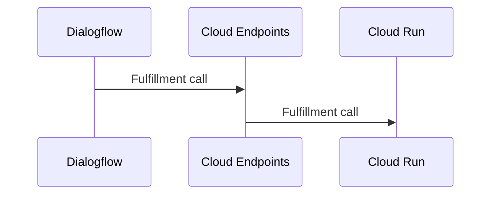

##  Overview

在GCP上我們一般會透過Service Account與IAM來設定服務的存取權限；在我的例子中，Cloud Run本身提供了Http Endpoint，而Dialogflow在呼叫Http Endpoint時必須手動在界面上指定Authorization Header與其JWT Token；Token本身會Expire．這樣其實並不符合Best Practice，因此在這裡我會透過Cloud Endpoints來作為Dialogflow呼叫的入口，在這裡針對任何對Cloud Run的呼叫進行驗證．




####    Setup Endpoints

-   Deploy ESP to Cloud Run

```bash
gcloud beta run deploy CLOUD_RUN_SERVICE_NAME \
    --image="gcr.io/endpoints-release/endpoints-runtime-serverless:1.30.0" \
    --allow-unauthenticated \
    --project=ESP_PROJECT_ID
#   gcloud beta run deploy dialogflow-demo-api-endpoints --image="gcr.io/endpoints-release/endpoints-runtime-serverless:1.30.0"  --allow-unauthenticated  --project=kalschi-demo-001
```

-   建立[Swagger檔案描述](../yaml/cloud-run-def.yaml)Cloud Run (Fulfillment)API

-   執行以下指令

```bash
gcloud endpoints services deploy cloud-run-def.yaml --project kalschi-demo-001
```

####    Troubleshoot

-   API Key名稱必須是key, 必須在query string, 否則會報以下錯誤

```bash
ERROR: (gcloud.endpoints.services.deploy) INVALID_ARGUMENT: Cannot convert to service config.
'location: "cloud-run-def.yaml"
message: "apiKey \'api_key\' is ignored. Only apiKey with \'name\' as \'key\' and \'in\' as \'query\' are supported"
 location: "cloud-run-def.yaml: Operation \'post\' in path \'/fulfillment/\'"
message: "Operation does not require an API key; callers may invoke the method without specifying an associated API-consuming project. To enable API key all the SecurityRequ
irement Objects (https://github.com/OAI/OpenAPI-Specification/blob/master/versions/2.0.md#security-requirement-object) inside security definition must reference at least one
 SecurityDefinition of type : \'apiKey\'."
 location: "unknown location"
kind: ERROR
message: "http: In path template \'/fulfillment/\': unexpected end of input \'/\'."
'
```

-   Successfuly

```bash
kalschi@cloudshell:~ (kalsch-demo-001)$ gcloud endpoints services deploy cloud-run-def.yaml --project kalschi-demo-001
Waiting for async operation operations/serviceConfigs.dialogflow-demo-api-endpoints-fd5tyopnsa-an.a.run.app:7959e012-4cf3-4f66-acd9-047c76f771ee to complete...
Operation finished successfully. The following command can describe the Operation details:
 gcloud endpoints operations describe operations/serviceConfigs.dialogflow-demo-api-endpoints-fd5tyopnsa-an.a.run.app:7959e012-4cf3-4f66-acd9-047c76f771ee

Waiting for async operation operations/rollouts.dialogflow-demo-api-endpoints-fd5tyopnsa-an.a.run.app:91b5120f-7f38-4c2d-b026-0d2a3fe54020 to complete...
Operation finished successfully. The following command can describe the Operation details:
 gcloud endpoints operations describe operations/rollouts.dialogflow-demo-api-endpoints-fd5tyopnsa-an.a.run.app:91b5120f-7f38-4c2d-b026-0d2a3fe54020

Service Configuration [2019-12-10r0] uploaded for service [dialogflow-demo-api-endpoints-fd5tyopnsa-an.a.run.app]

To manage your API, go to: https://console.cloud.google.com/endpoints/api/dialogflow-demo-api-endpoints-fd5tyopnsa-an.a.run.app/overview?project=kalschi-demo-001
```

####    設定Endpoints

```bash
gcloud beta run services update CLOUD_RUN_SERVICE_NAME  \
       --set-env-vars ENDPOINTS_SERVICE_NAME=YOUR_SERVICE_NAME \
       --project ESP_PROJECT_ID

gcloud beta run services update dialogflow-demo-api-endpoints --set-env-vars ENDPOINTS_SERVICE_NAME=dialogflow-demo-api --project kalschi-demo-001
```
##  Reference

-   https://cloud.google.com/endpoints/docs/openapi/get-started-cloud-run
-   