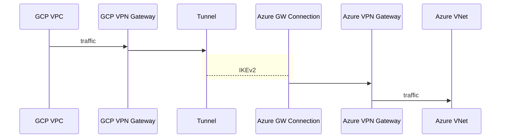
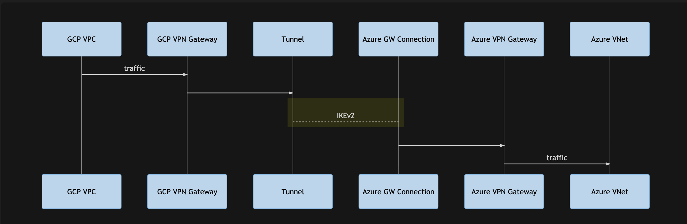
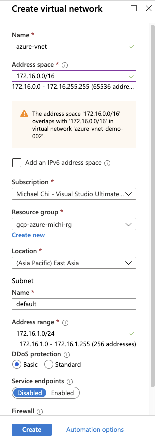
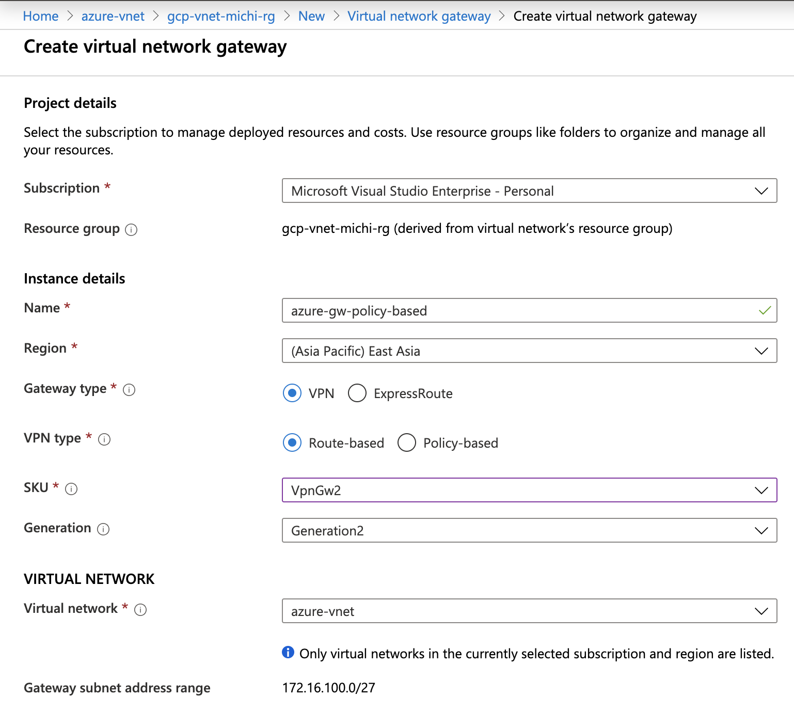
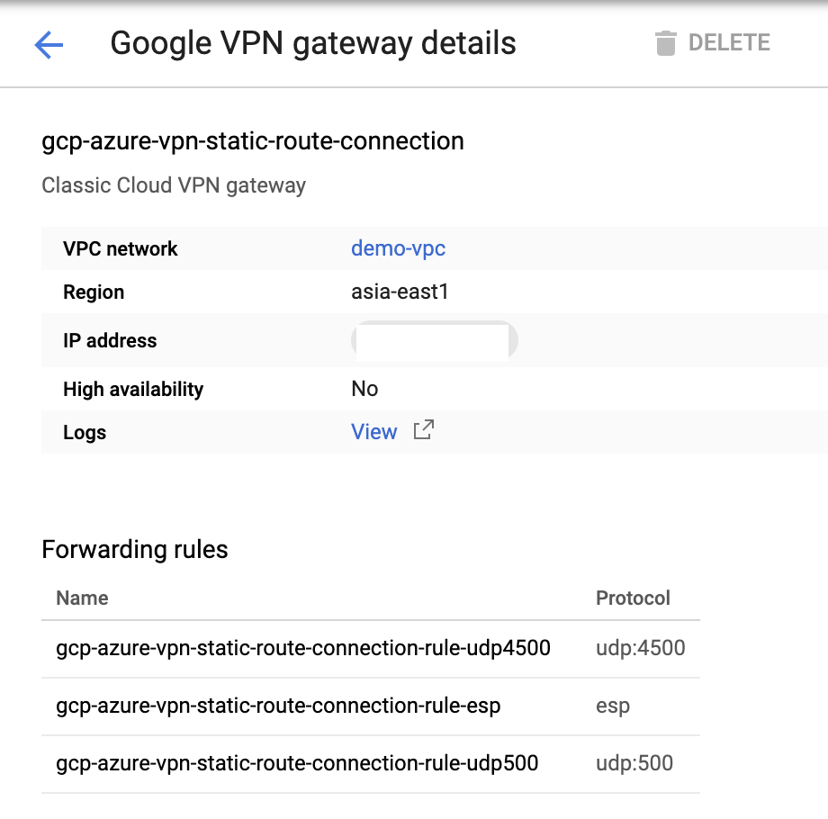
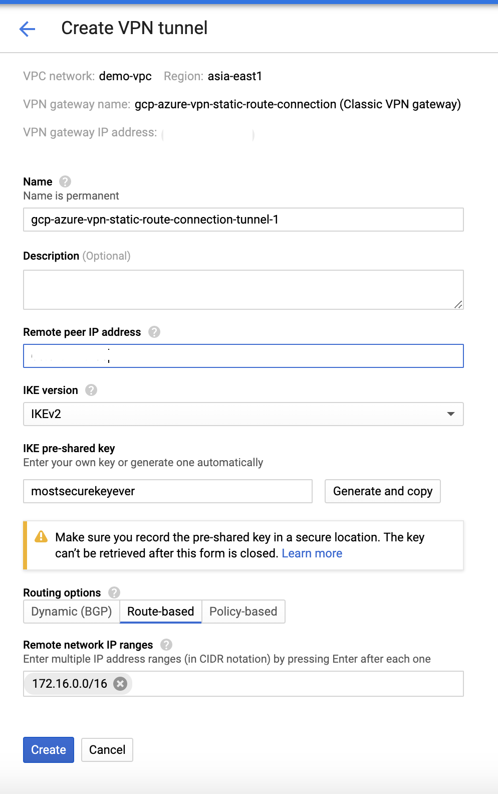
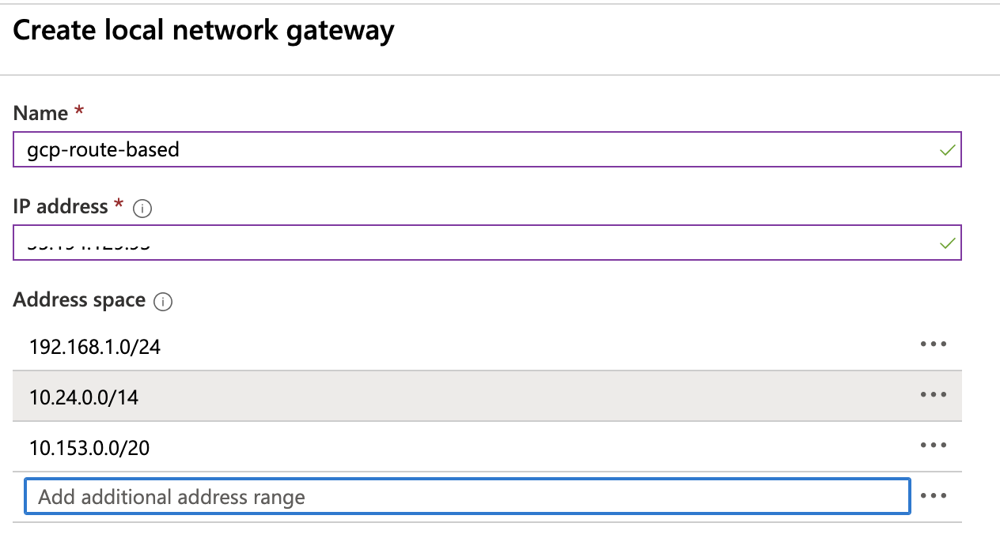
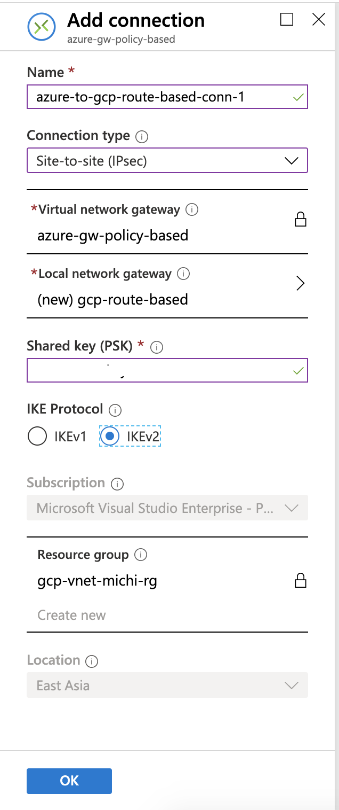
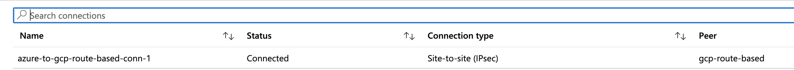
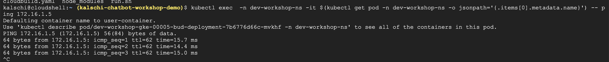

##  Overview

To verify hybrid connection, I am creating a Virtual Network in my Azure subscription as well as a Virtual Network Gateway as my on-prem envirionment.




###    Azure Environment Setup

Here I have an Azure Virtual Network with below configuration

| Resource          | Name          | Configuration |
--------------------|:-------------:|:-------------:|
| Virtual Network   | azure-vnet    | 172.16.0.0/16 |
| Virtual Network Gateway | azure-gw-policy-based | Route based |
||| Static VIP|

####  Step by Step
-------------------

We will first create a Virtual Network in Azure environment and a VPN with VPN Gateway in GCP environment.

-   Create Virtual Network




-   Create Virtual Network Gateway




###    GCP Environment Setup

####  Step by Step
-------------------

-   Create a Classic VPN on GCP


-   Create VPN Gateway on GCP



###    Create Connection between GCP and Azure

####    GCP Environment

-   Create a GCP Tunnel point to Azure Gateway using Route-based with IKE v2

|   Resourc | Configuration |
------------------------|--------------------------------------------------|
|   Remote Peer Address |   Put Azure VPN Gateway's Public IP address here |
|   IKE Version |   IKE v2  |
|   IKE Pre-shared key  | a share key, this key will be configured in Azure VPN gateway too |
|   Remote network IP range | Put GCP VPC's address CIDR here   |
|||




####    Azure Environment

-   Create a Local Gateway represent GCP's VPN Gateway



-   Create a connection points to GCP's VPN Gateway, input the shared key input above here.




### Result

-   Wait for serveral minutes, we should see connection established



-   Execute below command to verify connectivity in a running container

```bash
kubectl exec  -n <NAMESPACE> -it $(kubectl get pod -n <NAMESPACE> -o jsonpath='{.items[0].metadata.name}') -- ping <Remote Azure VM IP, ex 172.16.1.5>
```


