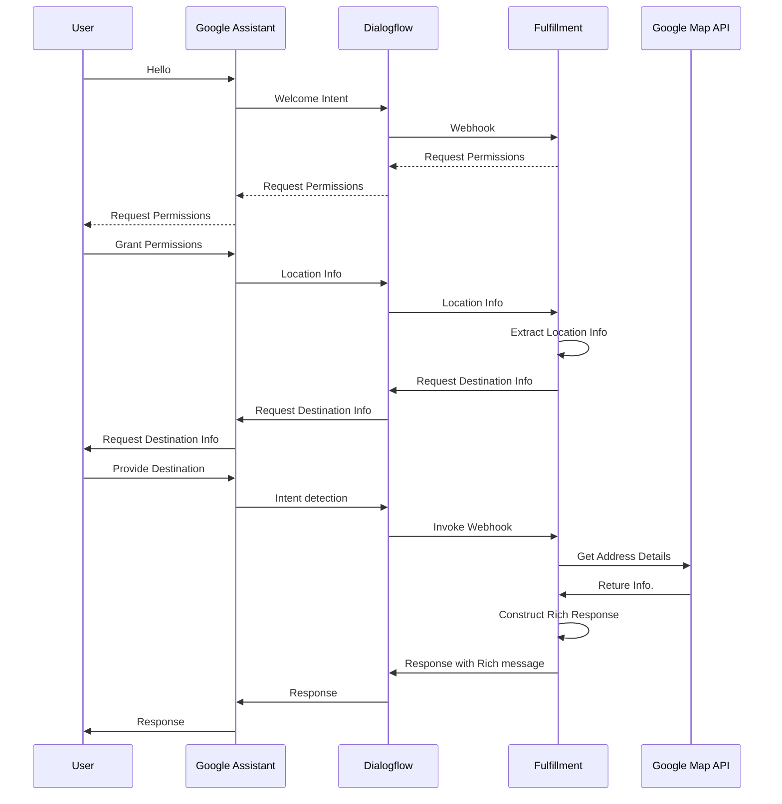

## Overview

為了學習GCP，我會以實作一個Google Assistant應用作為練習；在這個練習中，我會先以Dialog Flow製作基本的對話機器人的對話機制模擬一個計程車叫車機器人

在過程中，如果有遇到覺得有疑問或可能有其他做法的地方，我會把它列在[這裡](./to-be-investigated.md)

架構大致設計如下

>安裝[Chrome Mermaid extension](https://chrome.google.com/webstore/detail/mermaid-diagrams/phfcghedmopjadpojhmmaffjmfiakfil)以顯示下列Sequence Diagram

##  Table of Content

-   [Environment Setup](doc/env-setup.md)

-   [Translatiojn API Local Test and Deploy to Cloud Functions](doc/dgflow-cloud-functions.md)

-   [Create DialogFlow Agent](doc/dgflow-create-agent.md)

-   [Create REST API and containerize it](doc/dgflow-rest-api.md)

-   [Create a DialogFlow Agent helps to book TAXI](doc/dgflow-taxibot.md)

-   Deploy Fulfillment

    -   [Modify Fulfillment to meet new requirements](doc/run-integrate-google-assistant-and-map.md)

            包含Google Assistant與Google Map整合

    -   [Create private GKE cluster and deploy our application to it](doc/gke-create-cluster.md)

    -   [Deploy Fulfillment to Cloud Run](doc/run-deploy.md)

    -   [Secure Fulfillment Cloud Run with Endpoints](doc/run-secure-cloud-run.md)

    -   [Deploy Fulfillment to Cloud Run on Anthos](doc/cloud-run-on-gke/setup.md)

-   Ingest Book Taxi information to data warehouse

    -   [Create Pub/Sub Topic to receive Taxi inforamtio](doc/pubsub-setup.md)
    
    -   [Ingest Data into Bigquery with DataFlow](doc/dataflow-ingest-data-to-bigquery.md)

    -   [Batch upload files to BigQuery](doc/dataflow-batch-ingestion.md)

-   Create DataStudio Report

    -   [Create Report](doc/datastudio-create-reports.md)

-   VPN Setup

    -   [Connect GCP VPC to Azure Virtual Network](doc/vpn-setup.md)
    
## References

-   [Kubernetes Connect to Cloud SQL](https://blog.johnwu.cc/article/gcp-kubernetes-connect-to-cloudsql.html)

-   [Real-time data analysis using Google Kubernetes Engine, Redis or PubSub, and BigQuery](https://github.com/GoogleCloudPlatform/kubernetes-bigquery-python/blob/master/pubsub/pubsub-pipe-image/utils.py#L37)

-   [GCP Authentication](https://cloud.google.com/docs/authentication/production)

-   [Build fulfillment with the Actions on Google Node.js client library](https://developers.google.com/assistant/actions/reference/nodejsv2/overview)

-   [Actions on Google Message Flow and Architecture](https://developers.google.com/assistant/actions/reference/nodejsv2/overview)
