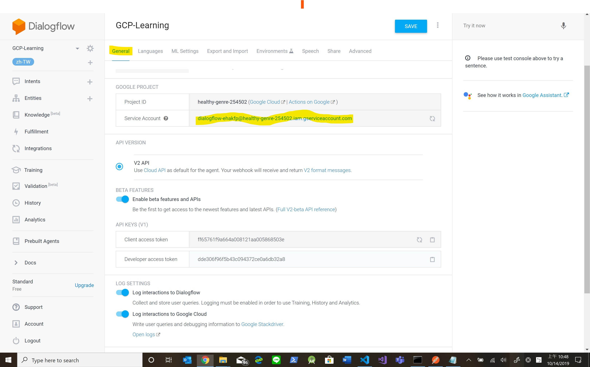
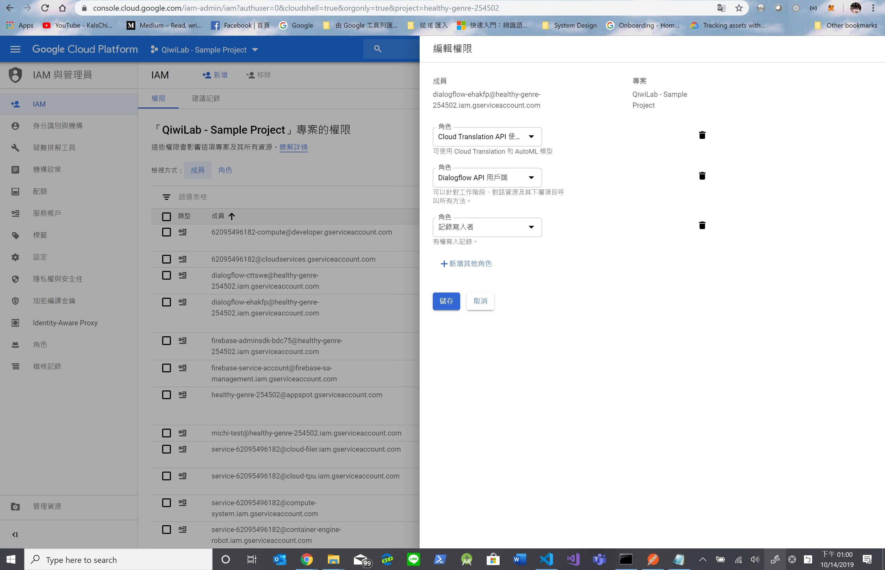
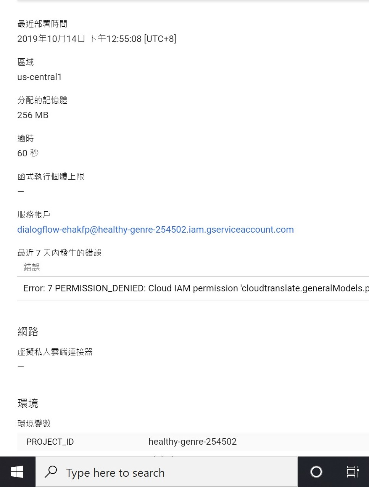
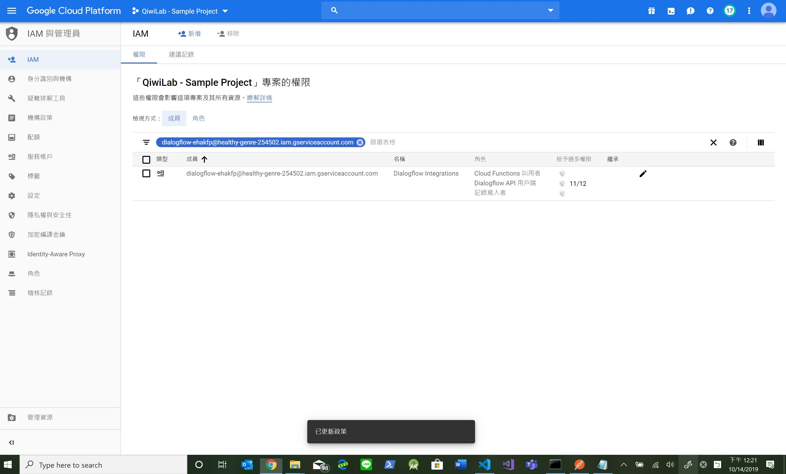

## Overview

```shell
$env:GOOGLE_APPLICATION_CREDENTIALS="C:\temp\src\gcp-dialogflow-learning\keys\QiwiLab - Sample Project - Translation API - 2c2b3f00d59d.json"
```

#### Development Environment Setup

-   Download and Install [nvm](https://github.com/coreybutler/nvm-windows/releases)

#### Setup Git SSH Key on Windows

-   Open cmd prompt, run below command

```shell
ssh-keygen -t rsa 
```

-   Follow instruction to enter passphrase

-   Open C:\users\[your name]\.ssh\id_rsa.pub, copy everything

-   Go back to [GCP console](https://source.cloud.google.com/user/ssh_keys?register=true), create a new Key

-   Paste content copied above as key

-   Save and register


#### Service Account Setting

-   DialogFlow




-   Translation API Roles



-   Cloud Functions



-   Roles




## Kubernetes Cluster

https://blog.johnwu.cc/article/gcp-kubernetes-connect-to-cloudsql.html

https://github.com/GoogleCloudPlatform/kubernetes-bigquery-python/blob/master/pubsub/pubsub-pipe-image/utils.py#L37

https://cloud.google.com/docs/authentication/production?hl=zh-tw

```shell
gcloud container clusters create dialogflow-fulfillment --zone asia-east1-a --machine-type n1-standard-1 --max-nodes 1

// verify:
//  docker run -p 33333:3000 kalschi/gcp-df-test:1.00

docker build . -t kalschi/gcp-df-test:1.00

docker push kalschi/gcp-df-test:1.00  


kubectl apply -f ./df-deployment.yaml
kubectl apply -f ./df-service.yaml


kubectl get services

// verify:
//  wget http://<EXTERNAL IP>:33333


// TODO:
//  Need to find out how to use gcloud service account in K8s cluster
//  https://ithelp.ithome.com.tw/articles/10195944
//  https://cloud.google.com/kubernetes-engine/docs/tutorials/authenticating-to-cloud-platform?hl=zh-tw

//  IAM: https://cloud.google.com/kubernetes-engine/docs/tutorials/authenticating-to-cloud-platform?hl=zh-tw
```

