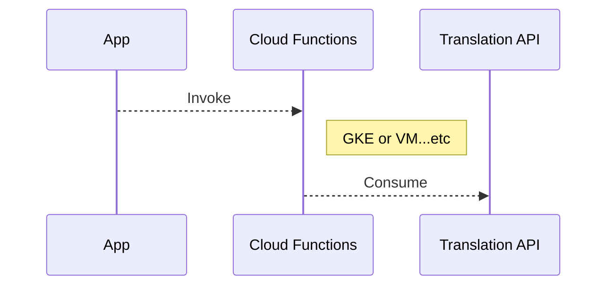

## Overview

為了學習GCP，我會以實作一個Google Assistant應用作為練習；在這個練習中，我會先以Dialog Flow製作基本的對話機器人的對話機制，透過Cloud Function呼叫Translation API讓機器人可以翻譯使用者輸入的文字．

接著我會把Cloud Function改為GKE以Container方式包裝我的後端服務，然後部署到GKE上，並設置相關的防火牆規則等．在過程中，如果有遇到覺得有疑問或可能有其他做法的地方，我會把它列在[這裡](./to-be-investigated.md)

架構大致設計如下

>安裝[Chrome Mermaid extension](https://chrome.google.com/webstore/detail/mermaid-diagrams/phfcghedmopjadpojhmmaffjmfiakfil)以顯示下列Sequence Diagram

##  Table of Content

-   [Environment Setup](doc/env-setup.md)

-   [Translatiojn API Local Test and Deploy to Cloud Functions](doc/dgflow-cloud-functions.md)

-   [Create DialogFlow Agent](doc/dgflow-create-agent.md)

-   [Create REST API and containerize it](doc/dgflow-rest-api.md)

-   [Create a DialogFlow Agent helps to book TAXI](doc/dgflow-taxibot.md)

-   Deploy Fulfillment

    -   [Create private GKE cluster and deploy our application to it](doc/gke-create-cluster.md)

    -   [Deploy Fulfillment to Cloud Run](doc/run-deploy.md)
    
## References

-   https://blog.johnwu.cc/article/gcp-kubernetes-connect-to-cloudsql.html

-   https://github.com/GoogleCloudPlatform/kubernetes-bigquery-python/blob/master/pubsub/pubsub-pipe-image/utils.py#L37

-   https://cloud.google.com/docs/authentication/production?hl=zh-tw

－  https://developers.google.com/assistant/actions/reference/nodejsv2/overview
