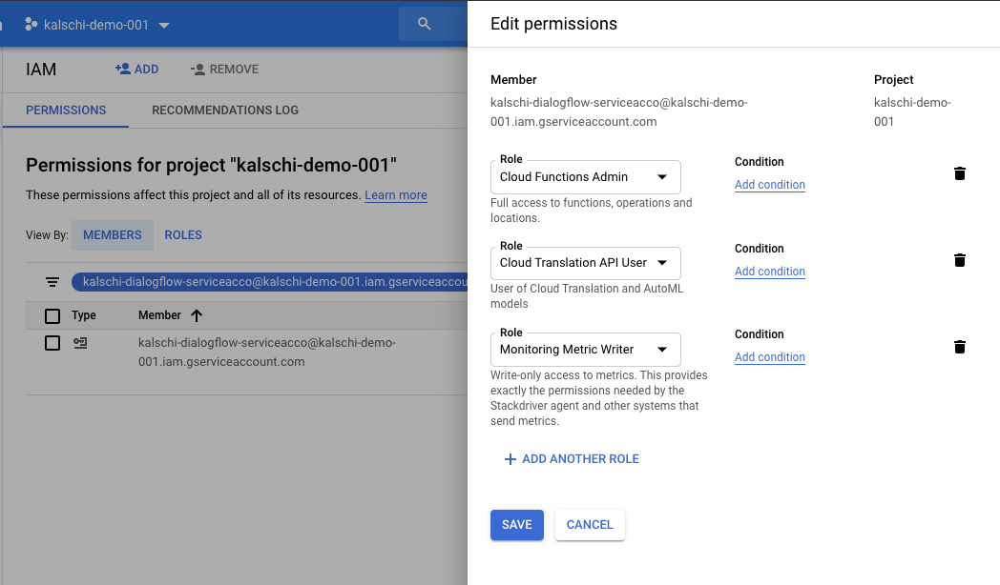

##  Overview
In order to be able to auto scale my backend fulfillment API, I am to setup auto-scaling for kubernetes deployments based on custom metric as well as to scale cluster nodes based on resource usage.


####    Deployment Stackdriver adapter

-   Grant permission to current user and deploy Adapter

```bash
kubectl create clusterrolebinding cluster-admin-binding --clusterrole cluster-admin --user "$(gcloud config get-value account)"

kubectl create -f https://raw.githubusercontent.com/GoogleCloudPlatform/k8s-stackdriver/master/custom-metrics-stackdriver-adapter/deploy/production/adapter.yaml
```

-   [Update codes to publush custom metrics](../../processors/MetricsManager.js)

-   Create new image and push to Google Container Registry

```bash
gcloud auth configure-docker
docker tag <LOCALIMAGE> asia.gcr.io/kalschi-demo-001/conversational-ai-demo:latest
docker push asia.gcr.io/kalschi-demo-001/conversational-ai-demo:latest
```

-   Update deployment to use latest image

```bash
kubectl set image deployment dialogflow-fulfillment dialogflow-fulfillment=asia.gcr.io/kalschi-demo-001/conversational-ai-demo:latest
```

-   Now we also need to grant our service account permission to create custom metric. We do this by editing permission of our service account on GCP console



-   Finally, rollout new images
```bash
kubectl rollout restart deployment/<Deployment Name>
# kubectl rollout restart deployment/dialogflow-fulfillment
```
##  References

-   [Resize nodes](https://cloud.google.com/kubernetes-engine/docs/how-to/resizing-a-cluster)

-   [Cuarom Metrics Autoscaling](https://cloud.google.com/kubernetes-engine/docs/tutorials/custom-metrics-autoscaling)